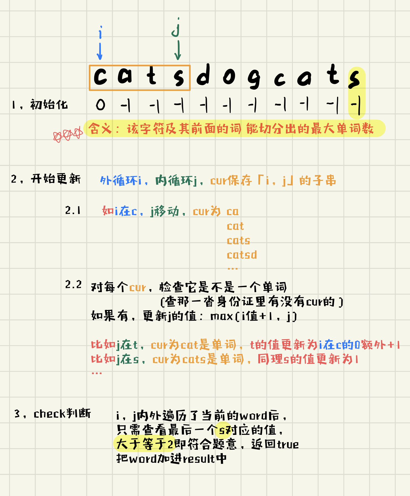

# 472. Concatenated Words （待学习）
```
Given an array of strings words (without duplicates), return all the concatenated words in the given list of words.

A concatenated word is defined as a string that is comprised entirely of at least two shorter words (not necesssarily distinct) in the given array.

 

Example 1:

Input: words = ["cat","cats","catsdogcats","dog","dogcatsdog","hippopotamuses","rat","ratcatdogcat"]
Output: ["catsdogcats","dogcatsdog","ratcatdogcat"]
Explanation: "catsdogcats" can be concatenated by "cats", "dog" and "cats"; 
"dogcatsdog" can be concatenated by "dog", "cats" and "dog"; 
"ratcatdogcat" can be concatenated by "rat", "cat", "dog" and "cat".
```

## Solution 1 （dp）
```
（1）题目要求： 判断当前词是否由两个及以上的词组成
（2）核心思路： 1、字符串哈希； 2、DP数组更新
 
 
（3）首先用白话整体过一遍我们做了什么：
1、字符串哈希：（目标：为了查找，提高效率）
 给words中的每个word发一个身份证（哈希值），
 所有身份证给班主任保管（存入Set），以待后面查找
2、DP数组更新：（目标：更新状态，判断是否符合题意）
 对被判断的word，把行李、包、人（对应word中每个字母）分开过安检（check）
   情况一：中途发现你有违规物品了（-1），最后你肯定不合格。
   情况二：检查到最后报警器都没响，你合格了，放入res中。

```

### 如上图，要注意的1.含义；2.check的时候大于等于2
```java
class Solution {
    int P = 131, OFFSET = 128;
    Set set = new HashSet();

    public List<String> findAllConcatenatedWordsInADict(String[] words) {
        int n = words.length;
        List<String> ans = new ArrayList<>();
        
        //字符串哈希：一个字符串对应一个值
        for (int i = 0; i < n; i++) {
            long hash = 0;
            for (char c : words[i].toCharArray()) 
                //哈希值的计算由每个字符来生成
                hash = hash * P + (c - 'a') + OFFSET;
            set.add(hash);
        }
        
        for (String s : words)
            if (check(s))   
                ans.add(s);
    
        return ans;
    }

    boolean check(String s) {
        int n = s.length();
        int[] f = new int[n + 1];
        Arrays.fill(f, -1);
        f[0] = 0;

        //以下代码类似双指针滑动窗口
        for (int i = 0; i <= n; i++) {                  //[i,j]，i不断移动
            if (f[i] == -1) continue;
            long cur = 0;                               //暂存[i,j]这个子串
            for (int j = i + 1; j <= n; j++) {          //[i,j]，j不断移动
                cur = cur * P + (s.charAt(j - 1) - 'a') + OFFSET;   //计算字符串哈希值，查找
                if (set.contains(cur))                              //存在[i,j]这个单词
                    f[j] = Math.max(f[j], f[i] + 1);    //f[j]是j之前由几个单词组成
            }
            if (f[n] > 1) return true;
        }
        return false;
    }
}

```