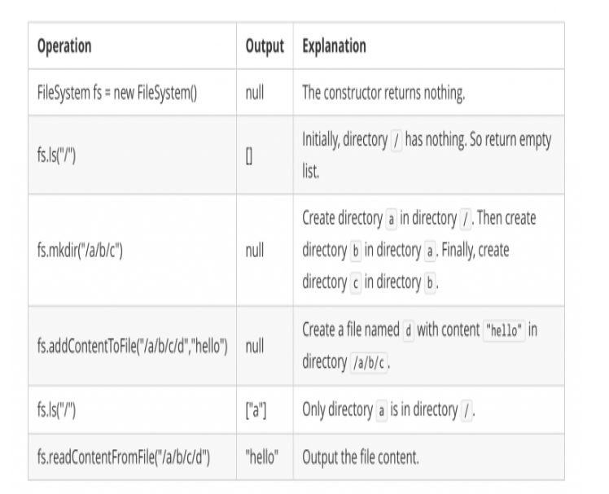

# 588 设计内存文件系统

设计一个内存文件系统，模拟以下功能：

ls： 以字符串的格式输入一个路径。如果它是一个文件的路径，那么函数返回一个列表，仅包含这个文件的名字。如果它是一个文件夹的的路径，那么返回该 文件夹内 的所有文件和子文件夹的名字。你的返回结果（包括文件和子文件夹）应该按字典序排列。

mkdir：输入一个当前不存在的 文件夹路径 ，你需要根据路径名创建一个新的文件夹。如果有上层文件夹路径不存在，那么你也应该将它们全部创建。这个函数的返回类型为 void 。

addContentToFile： 输入字符串形式的 文件路径 和 文件内容 。如果文件不存在，你需要创建包含给定文件内容的文件。如果文件已经存在，那么你需要将给定的文件内容 追加 在原本内容的后面。这个函数的返回类型为 void。

readContentFromFile： 输入 文件路径 ，以字符串形式返回该文件的 内容 。
```
示例：

输入: 
["FileSystem","ls","mkdir","addContentToFile","ls","readContentFromFile"]
[[],["/"],["/a/b/c"],["/a/b/c/d","hello"],["/"],["/a/b/c/d"]]
输出: [null,[],null,null,["a"],"hello"] 
```


思路：

文件系统构成了一个树状结构，所以本题目的一个解法就是建立一个树状结构来模拟文件系统。但是由于本题目是简化版的文件系统，所以我们也可以用更简单的字典树来实现。我们定义一个TrieNode的结构来统一表示文件和文件夹。如果isFile为true，则content表示文件的具体内容，此时children无效；否则children表示文件夹下的子文件（夹）列表，而content无效。下面给出各个函数的实现说明：

vector<string> ls(string path)：首先按照path给出的路径，在字典树中找到相应的文件（夹）。如果是文件，则返回它本身；否则就返回文件夹下面的所有子文件（夹）构成的列表。

void mkdir(string path)：按照path给出的路径，在字典树中找相应的文件夹，如果发现文件夹不存在，则新建文件夹。这样处理直到路径末尾。

void addContentToFile(string filePath, string content)：按照filePath给出的路径，在字典树中找相应的文件（如果文件或者文件夹不存在，则新建），最后将内容追加到找到（新建）的文件夹中即可。

string readContentFromFile(string filePath)：按照path给出的路径去找相应的文件，最后返回对应文件的内容即可。

## Solution 1
```java
public class FileSystem {
    class Dir {
        HashMap < String, Dir > dirs = new HashMap < > ();
        HashMap < String, String > files = new HashMap < > ();
    }
    Dir root;
    public FileSystem() {
        root = new Dir();
    }
    public List < String > ls(String path) {
        Dir t = root;
        List < String > files = new ArrayList < > ();
        if (!path.equals("/")) {
            String[] d = path.split("/");
            for (int i = 1; i < d.length - 1; i++) {
                t = t.dirs.get(d[i]);
            }
            if (t.files.containsKey(d[d.length - 1])) {
                files.add(d[d.length - 1]);
                return files;
            } else {
                t = t.dirs.get(d[d.length - 1]);
            }
        }
        files.addAll(new ArrayList < > (t.dirs.keySet()));
        files.addAll(new ArrayList < > (t.files.keySet()));
        Collections.sort(files);
        return files;
    }

    public void mkdir(String path) {
        Dir t = root;
        String[] d = path.split("/");
        for (int i = 1; i < d.length; i++) {
            if (!t.dirs.containsKey(d[i]))
                t.dirs.put(d[i], new Dir());
            t = t.dirs.get(d[i]);
        }
    }

    public void addContentToFile(String filePath, String content) {
        Dir t = root;
        String[] d = filePath.split("/");
        for (int i = 1; i < d.length - 1; i++) {
            t = t.dirs.get(d[i]);
        }
        t.files.put(d[d.length - 1], t.files.getOrDefault(d[d.length - 1], "") + content);
    }

    public String readContentFromFile(String filePath) {
        Dir t = root;
        String[] d = filePath.split("/");
        for (int i = 1; i < d.length - 1; i++) {
            t = t.dirs.get(d[i]);
        }
        return t.files.get(d[d.length - 1]);
    }
}

/**
 * Your FileSystem object will be instantiated and called as such:
 * FileSystem obj = new FileSystem();
 * List<String> param_1 = obj.ls(path);
 * obj.mkdir(path);
 * obj.addContentToFile(filePath,content);
 * String param_4 = obj.readContentFromFile(filePath);
 */
 ```

 ## solution 2
 ```java
 Node root = new Node();
public FileSystem() {
}

public List<String> ls(String path) {
    String[] dirs = path.split("/");
    Node node=root;
    for(String dir : dirs){
        if("".equals(dir)) continue;
        node=node.fileList.get(dir);
    }
    List<String> res = new ArrayList<>(node.fileList.keySet());
    return res;
}

public void mkdir(String path) {
    String[] dirs = path.split("/");
    Node node=root;
    for(String dir : dirs){
        if("".equals(dir)) continue;
        Node child=node.fileList.get(dir);
        if(child==null){
            child=new Node();
            node.fileList.put(dir, child);
        }
        node = child;
    }
}

public void addContentToFile(String filePath, String content) {
    String[] dirs = filePath.split("/");
    Node node=root;
    for(int i=0;i<dirs.length;i++){
        String dir=dirs[i];
        if("".equals(dir)) continue;
        Node child=node.fileList.get(dir);
        if(child==null){
            child=new Node();
            node.fileList.put(dir, child);
        }
        if(i==dirs.length-1){
            child.text.append(content);
            child.fileList.put(dir,null);
        }
        node = child;
    }
}

public String readContentFromFile(String filePath) {
    String[] dirs = filePath.split("/");
    Node node=root;
    for(String dir : dirs){
        if("".equals(dir)) continue;
        node=node.fileList.get(dir);
    }
    return node.text.toString();
}
    
class Node{
    Map<String, Node> fileList = new TreeMap<>();
    StringBuilder text= new StringBuilder();
}
```