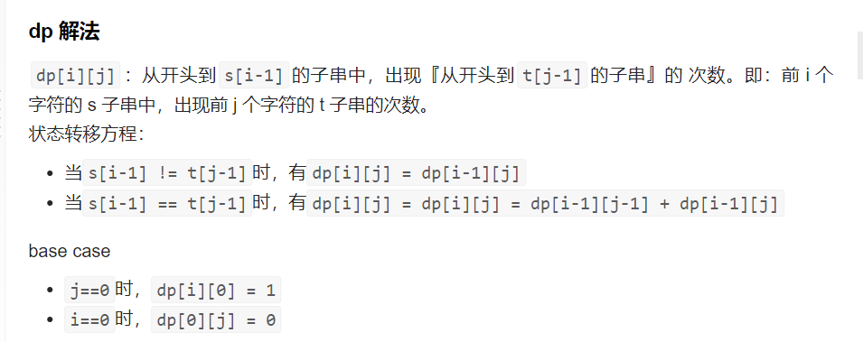

# 115. Distinct Subsequences

Given two strings s and t, return the number of distinct 
subsequences
 of s which equals t.

The test cases are generated so that the answer fits on a 32-bit signed integer.

 
```
Example 1:

Input: s = "rabbbit", t = "rabbit"
Output: 3
Explanation:
As shown below, there are 3 ways you can generate "rabbit" from s.
rabbbit
rabbbit
rabbbit
Example 2:

Input: s = "babgbag", t = "bag"
Output: 5
Explanation:
As shown below, there are 5 ways you can generate "bag" from s.
babgbag
babgbag
babgbag
babgbag
babgbag
```
## Solution 1 (dp)

```
题解中的关键：

s[i] == t[j]的时候, s[i] 可以选择自己是否跟 t[j]匹配

如果匹配，那么 dp[i][j] 其中一部分数量就是 dp[i+1][j+1]
如果选择不匹配（这样可以让前面的字符跟t[j]匹配，毕竟t 短的,s 长) dp[i][j] 另外一部分就是 dp[i+1][j]
所以才会有：

dp[i][j] = dp[i+1][j+1] + dp[i+1][j]
```

### 思路
确定dp数组（dp table）以及下标的含义
dp[i][j]：以i-1为结尾的s子序列中出现以j-1为结尾的t的个数为dp[i][j]。
这一类问题，基本是要分析两种情况

s[i - 1] 与 t[j - 1]相等
s[i - 1] 与 t[j - 1] 不相等
当s[i - 1] 与 t[j - 1]相等时，dp[i][j]可以有两部分组成。

一部分是用s[i - 1]来匹配，那么个数为dp[i - 1][j - 1]。即不需要考虑当前s子串和t子串的最后一位字母，所以只需要 dp[i-1][j-1]。

一部分是不用s[i - 1]来匹配，个数为dp[i - 1][j]。
一部分是不用s[i - 1]来匹配的情况：有重复的字符 比如bagggg

dp数组如何初始化
从递推公式dp[i][j] = dp[i - 1][j - 1] + dp[i - 1][j]; 和 dp[i][j] = dp[i - 1][j]; 中可以看出dp[i][j] 是从上方和左上方推导而来，如图：，那么 dp[i][0] 和dp[0][j]是一定要初始化的。

确定遍历顺序
从递推公式dp[i][j] = dp[i - 1][j - 1] + dp[i - 1][j]; 和 dp[i][j] = dp[i - 1][j]; 中可以看出dp[i][j]都是根据左上方和正上方推出来的。

所以遍历的时候一定是从上到下，从左到右，这样保证dp[i][j]可以根据之前计算出来的数值进行计算。

代码如下：
```
for (int i = 1; i <= s.size(); i++) {
    for (int j = 1; j <= t.size(); j++) {
        if (s[i - 1] == t[j - 1]) {
            dp[i][j] = dp[i - 1][j - 1] + dp[i - 1][j];
        } else {
            dp[i][j] = dp[i - 1][j];
        }
    }
}
```


二维数组 java
```java
class Solution {
    public int numDistinct(String s, String t) {
        int m = s.length(), n = t.length();
        if (m < n) {
            return 0;
        }
        int[][] dp = new int[m + 1][n + 1];
        for (int i = 0; i <= m; i++) {
            dp[i][n] = 1;
        }
        for (int i = m - 1; i >= 0; i--) {
            char sChar = s.charAt(i);
            for (int j = n - 1; j >= 0; j--) {
                char tChar = t.charAt(j);
                if (sChar == tChar) {
                    dp[i][j] = dp[i + 1][j + 1] + dp[i + 1][j];
                } else {
                    dp[i][j] = dp[i + 1][j];
                }
            }
        }
        return dp[0][0];
    }
}

```
python
```python
class Solution:
    def numDistinct(self, s: str, t: str) -> int:
        m, n = len(s), len(t)
        if m < n:
            return 0
        
        dp = [[0] * (n + 1) for _ in range(m + 1)]
        for i in range(m + 1):
            dp[i][n] = 1
        
        for i in range(m - 1, -1, -1):
            for j in range(n - 1, -1, -1):
                if s[i] == t[j]:
                    dp[i][j] = dp[i + 1][j + 1] + dp[i + 1][j]
                else:
                    dp[i][j] = dp[i + 1][j]
        
        return dp[0][0]
```
复杂度分析

时间复杂度：O(mn)，其中 m 和 n 分别是字符串 s 和 t 的长度。二维数组 dp
有 m+1 行和 n+1 列，需要对 dp 中的每个元素进行计算。

空间复杂度：O(mn)，其中 m 和 n 分别是字符串 s 和 t 的长度。创建了m+1 行 n+1 列的二维数组 dp。


空间优化：一维数组
>空间上的优化：在遍历过程中可以发现，实际上用到的数据只有上一行的数据，和当前行需要修改的数据，因此只需要2个一维数组即可，这样就可以实现空间的压缩，还省去了初始化二维数组的时间。 下面附上代码：
```java
public int numDistinct(String s, String t) {
        char[] tChars = t.toCharArray();
        int n = s.length();
        int m = t.length();

        int[] dp = new int[m + 1];  //当前行的数据
        int[] temp = new int[m + 1];    //上一行的数据
        dp[0] = 1;
        temp[0] = 1;

        for (int i = 0; i < n; i++) {
            char ch = s.charAt(i);
            for (int j = 1; j < m + 1; j++) {
                if (ch == tChars[j - 1]) {
                    dp[j] += temp[j-1];
                }
                temp[j-1] = dp[j-1];    //顺带刷新缓存的上一行数据（数据已经被使用过，可以刷新覆盖）
            }
        }
        return dp[m];
    }
    ```

## Solution 2(记忆化搜索)
```java
class Solution {
    public int numDistinct(String s, String t) {
        //记忆化递归
        int m = s.length() , n = t.length();
        if(m < n)
            return 0;
        int[][] dp = new int[m][n];
        //填充数组
        for(int i = 0; i < m; i++)
            for(int j = 0; j < n; j++)
                dp[i][j] = -1;
        return helper(dp , m - 1, n - 1, s, t);
    }

    private int helper(int[][] dp , int i , int j , String s , String t)
    {
        if(j < 0)
            return 1;
        if(i < 0)
            return 0;
        if(dp[i][j] != -1)  //记忆化搜索
            return dp[i][j];
        if(s.charAt(i) == t.charAt(j))
            return dp[i][j] = helper(dp , i-1 , j-1 , s, t) + helper(dp , i-1, j , s, t);
        return dp[i][j] = helper(dp , i-1, j , s , t);
    }
}
```


## 乱入
**别人思路分析:**
```
【五种实现】

常规二维dp
交替滚动一维dp
原地滚动一维dp（借助变量正序版）
原地滚动一维dp（逆序版）
原地滚动一维dp（逆序版，最后一行只更新最终答案）
【解法套路四步走】

1）根据问题给出二维dp数组定义。

要求s子序列中t的个数。立刻定义dp[i][j]: s的前i个字符中的t的前j个字符的子序列个数。后续为了方便叙述，dp[i][j]描述为字符串s_i中t_j的个数。

2）分别令两个维度为0，推测边界。

dp[0][j]表示s_0中t_j的个数。s_0是空字符串，只有当j=0时，才有dp[0][j] = 1，表示s子空串中有一个t子空串，否则dp[0][j] = 0，因为一个空串不可能包含一个非空串。

dp[i][0]表示s_i中t0的个数。t_0是空字符串，显然任何串（包括空串）都含有一个空子串。因此dp[i][0] = 1。

注意到，dp[i][0] = 1实际上已经包含了dp[0][j] = 1的情形。

3）寻找转移方程。

dp[i][j]显然要从dp[i-1][?]递推而来。立即思考dp[i-1][j], dp[i-1][j-1]分别与dp[i][j]的关系。

因为少一个字符，自然而然从当前字符着手。考察si的第i个字符(表为s[i])和tj的第j个字符(表为t[j])的关系。

若s[i] ≠ t[j]：那么s_i中的所有t_j子序列，必不包含s[i]，即s_i-1和s_i中tj的数量是一样的，得到该情形的转移方程:

dp[i][j] = dp[i-1][j]
若s[i] = t[j]：假设s_i中的所有t_j子序列中，包含s[i]的有a个，不包含的有b个。s_i中包含s[i]的子序列个数相当于s_i-1中t_j-1的个数，不包含s[i]的子序列个数与上一种情况一样，于是得到该情形的转移方程：

a = dp[i-1][j-1]
b = dp[i-1][j]
dp[i][j] = a + b = dp[i-1][j-1] + dp[i-1][j]
4）空间压缩。

也是固定套路，先从二维数组转两个一维数组（交替滚动），再从两个一维数组转一个一维数组（原地滚动），原地滚动时要注意是否需要逆序。可借助变量来实现正序一维滚动dp，也可以不借助变量直接一维逆序滚动dp。

下面给出代码。

==== 二维dp ====

class Solution {
    public int numDistinct(String s, String t) {
        if(s.length() < t.length()) return 0; // s长度小于t时，s中不会出现t
        int ns = s.length(), nt = t.length();
        char[] chss = s.toCharArray(), chst = t.toCharArray();
        int[][] dp = new int[ns + 1][nt + 1];
        for(int i = 0; i <= ns; i++) dp[i][0] = 1; 
        for(int i = 1; i <= ns; i++){
            for(int j = 1; j <= nt; j++){
                dp[i][j] = dp[i - 1][j] + (chss[i - 1] == chst[j - 1] ? dp[i - 1][j - 1] : 0);
            }
        }
        return dp[ns][nt];
    }
}
==== 交替滚动一维dp ====

class Solution {
    public int numDistinct(String s, String t) {
        if(t.length() > s.length()) return 0; // s长度小于t时间直接返回0
        int ns = s.length(), nt = t.length();
        int[] pre = new int[nt + 1], cur = new int[nt + 1];
        char[] chss = s.toCharArray(), chst = t.toCharArray();
        pre[0] = 1;
        cur[0] = 1; // 当t为空串时，此行是必须的
        for(int i = 1; i <= ns; i++){
            for(int j = 1; j <= nt; j++){
                if(chss[i - 1] == chst[j - 1]) cur[j] = pre[j - 1] + pre[j];
                else cur[j] = pre[j];
            }
            pre = Arrays.copyOf(cur, nt + 1); // for(int k = 0; k <= nt; k++) pre[k] = cur[k];
        }
        return cur[nt];
    }
}
==== 原地滚动一维dp 【借助变量正序】====

class Solution {
    public int numDistinct(String s, String t) {
        if(s.length() < t.length()) return 0; // s长度小于t时，s中不会出现t
        int ns = s.length(), nt = t.length();
        char[] chss = s.toCharArray(), chst = t.toCharArray();
        int[] dp = new int[nt + 1];
        dp[0] = 1;
        int pre = dp[0];
        for(int i = 1; i <= ns; i++){
            for(int j = 1; j <= nt; j++){
                int nextPre = dp[j]; // 相当于二维矩阵中待更新的dp[i][j]的dp[i - 1][j - 1]
                if(chss[i - 1] == chst[j - 1] ) dp[j] += pre;
                pre = nextPre;
            }
            pre = 1; // 每完成一行要重置该值为1
        }
        return dp[nt];
    }
}
==== 原地滚动一维dp 【逆序(无需变量辅助)】====

class Solution {
    public int numDistinct(String s, String t) {
        if(s.length() < t.length()) return 0; // s长度小于t时，s中不会出现t
        int ns = s.length(), nt = t.length();
        char[] chss = s.toCharArray(), chst = t.toCharArray();
        int[] dp = new int[nt + 1];
        dp[0] = 1;
        for(int i = 1; i <= ns; i++){ 
            for(int j = nt; j > 0; j--){
                if(chss[i - 1] == chst[j - 1] ) dp[j] += dp[j - 1];
            }
        }
        return dp[nt];
    }
}
==== 原地滚动一维dp 【最后一行只更新dp[nt]】====

class Solution {
    public int numDistinct(String s, String t) {
        if(s.length() < t.length()) return 0; // s长度小于t时，s中不会出现t
        int ns = s.length(), nt = t.length();
        char[] chss = s.toCharArray(), chst = t.toCharArray();
        int[] dp = new int[nt + 1];
        dp[0] = 1;
        for(int i = 1; i < ns; i++){ // 省一行
            for(int j = nt; j > 0; j--){
                if(chss[i - 1] == chst[j - 1] ) dp[j] += dp[j - 1];
            }
        }
        return chss[ns - 1] == chst[nt - 1] ? dp[nt] + dp[nt - 1] : dp[nt]; // 最后一行只需处理dp[nt]
    }
}
```