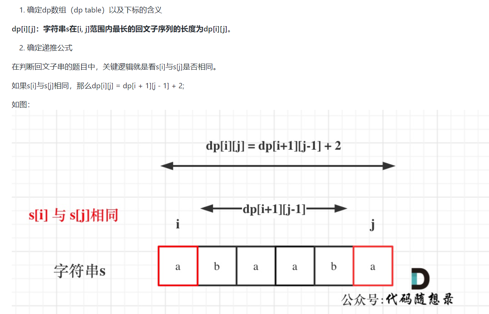
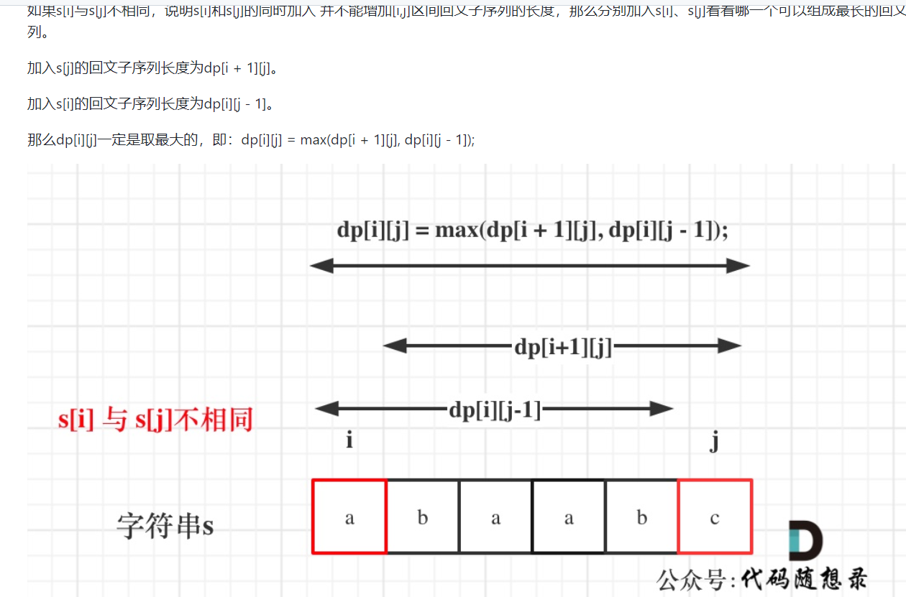
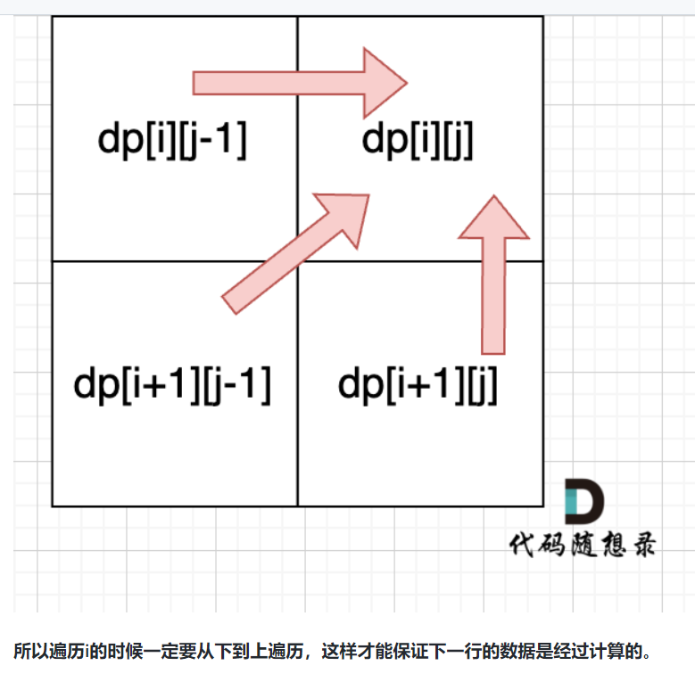

# 516. Longest Palindromic Subsequence

>Given a string s, find the longest palindromic subsequence's length in s.

A subsequence is a sequence that can be derived from another sequence by deleting some or no elements without changing the order of the remaining elements.

 
```
Example 1:

Input: s = "bbbab"
Output: 4
Explanation: One possible longest palindromic subsequence is "bbbb".
```

## Solution 1(dp)


``` java
if (s[i] == s[j]) {
    dp[i][j] = dp[i + 1][j - 1] + 2;
} else {
    dp[i][j] = max(dp[i + 1][j], dp[i][j - 1]);
}
```

### so, i: form size() -1 to 0, j from i+1 to size()

```java
for (int i = s.size() - 1; i >= 0; i--) {
    for (int j = i + 1; j < s.size(); j++) {
        if (s[i] == s[j]) {
            dp[i][j] = dp[i + 1][j - 1] + 2;
        } else {
            dp[i][j] = max(dp[i + 1][j], dp[i][j - 1]);
        }
    }
}
```

java:
```java
public class Solution {
    public int longestPalindromeSubseq(String s) {
        int len = s.length();
        int[][] dp = new int[len + 1][len + 1];
        for (int i = len - 1; i >= 0; i--) { // 从后往前遍历 保证情况不漏
            dp[i][i] = 1; // 初始化
            for (int j = i + 1; j < len; j++) {
                if (s.charAt(i) == s.charAt(j)) {
                    dp[i][j] = dp[i + 1][j - 1] + 2;
                } else {
                    dp[i][j] = Math.max(dp[i + 1][j], Math.max(dp[i][j], dp[i][j - 1]));
                }
            }
        }
        return dp[0][len - 1];
    }
}
```
python
```python
class Solution:
    def longestPalindromeSubseq(self, s: str) -> int:
        dp = [[0] * len(s) for _ in range(len(s))]
        for i in range(len(s)):
            dp[i][i] = 1
        for i in range(len(s)-1, -1, -1):
            for j in range(i+1, len(s)):
                if s[i] == s[j]:
                    dp[i][j] = dp[i+1][j-1] + 2
                else:
                    dp[i][j] = max(dp[i+1][j], dp[i][j-1])
        return dp[0][-1]

```