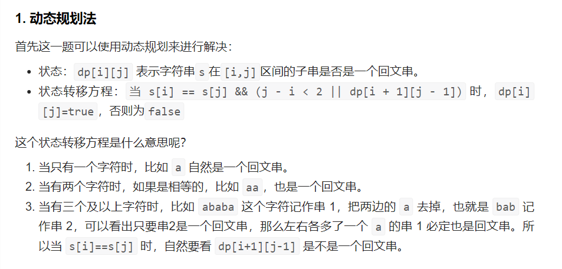

# 647. Palindromic Substrings

Given a string s, return the number of palindromic substrings in it.

A string is a palindrome when it reads the same backward as forward.

A substring is a contiguous sequence of characters within the string.

 
```
Example 1:

Input: s = "abc"
Output: 3
Explanation: Three palindromic strings: "a", "b", "c".
```
```
Example 2:

Input: s = "aaa"
Output: 6
Explanation: Six palindromic strings: "a", "a", "a", "aa", "aa", "aaa".
```

## Solution 1(dp)


` j j+1 j+2
i
i+1
i+2

所以一定要从下到上，从左到右遍历，这样保证dp[i + 1][j - 1]都是经过计算的  遍历顺序很重要
有的代码实现是优先遍历列，然后遍历行，其实也是一个道理，都是为了保证dp[i + 1][j - 1]都是经过计算的。
个人总结：
```
for i i--
    for j j++
```
```
for j j++
    for i i++
```

two case


```java
class Solution {
    public int countSubstrings(String s) {
        // 动态规划法
        boolean[][] dp = new boolean[s.length()][s.length()];
        int ans = 0;

        for (int j = 0; j < s.length(); j++) {
            for (int i = 0; i <= j; i++) {
                if (s.charAt(i) == s.charAt(j) && (j - i < 2 || dp[i + 1][j - 1])) {
                    dp[i][j] = true;
                    ans++;
                }
            }
        }

        return ans;
    }
}
```
另一种遍历，伪代码：
```
for (int i = s.size() - 1; i >= 0; i--) {  // 注意遍历顺序
    for (int j = i; j < s.size(); j++) {
        if (s[i] == s[j]) {
            if (j - i <= 1) { // 情况一 和 情况二
                result++;
                dp[i][j] = true;
            } else if (dp[i + 1][j - 1]) { // 情况三
                result++;
                dp[i][j] = true;
            }
        }
    }
}
```
## Solution 2(双指针) 中心扩展法
```
2. 中心扩展法
这是一个比较巧妙的方法，实质的思路和动态规划的思路类似。

比如对一个字符串 ababa，选择最中间的 a 作为中心点，往两边扩散，第一次扩散发现 left 指向的是 b，right 指向的也是 b，所以是回文串，继续扩散，同理 ababa 也是回文串。

这个是确定了一个中心点后的寻找的路径，然后我们只要寻找到所有的中心点，问题就解决了。

中心点一共有多少个呢？看起来像是和字符串长度相等，但你会发现，如果是这样，上面的例子永远也搜不到 abab，想象一下单个字符的哪个中心点扩展可以得到这个子串？似乎不可能。所以中心点不能只有单个字符构成，还要包括两个字符，比如上面这个子串 abab，就可以有中心点 ba 扩展一次得到，所以最终的中心点由 2 * len - 1 个，分别是 len 个单字符和 len - 1 个双字符。

如果上面看不太懂的话，还可以看看下面几个问题：

为什么有 2 * len - 1 个中心点？
aba 有5个中心点，分别是 a、b、c、ab、ba
abba 有7个中心点，分别是 a、b、b、a、ab、bb、ba
什么是中心点？
中心点即 left 指针和 right 指针初始化指向的地方，可能是一个也可能是两个
为什么不可能是三个或者更多？
因为 3 个可以由 1 个扩展一次得到，4 个可以由两个扩展一次得到
```
这个方法的时间复杂度是
O(N^2)，空间复杂度是 O(1)。
 (暂跳)
```java
class Solution {
    public int countSubstrings(String s) {
        // 中心扩展法
        int ans = 0;
        for (int center = 0; center < 2 * s.length() - 1; center++) {
            // left和right指针和中心点的关系是？
            // 首先是left，有一个很明显的2倍关系的存在，其次是right，可能和left指向同一个（偶数时），也可能往后移动一个（奇数）
            // 大致的关系出来了，可以选择带两个特殊例子进去看看是否满足。
            int left = center / 2;
            int right = left + center % 2;

            while (left >= 0 && right < s.length() && s.charAt(left) == s.charAt(right)) {
                ans++;
                left--;
                right++;
            }
        }
        return ans;
    }
}

```
