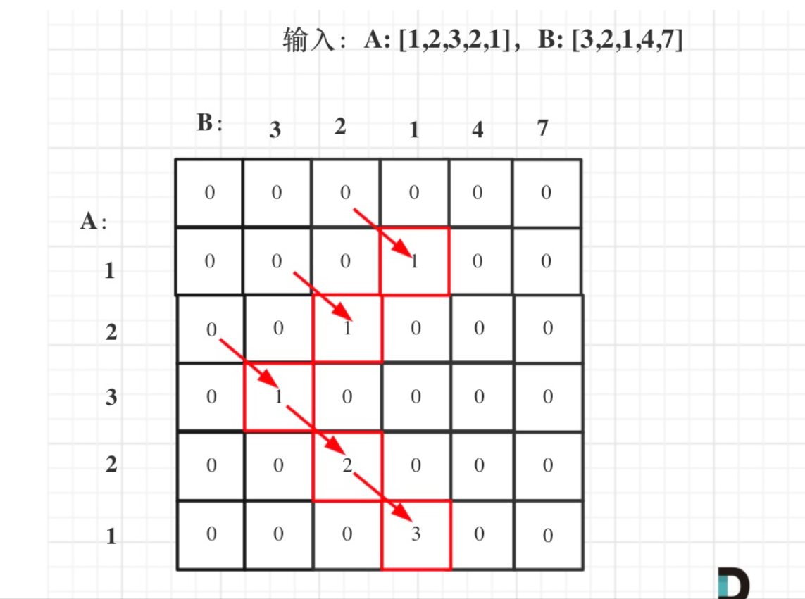

# 718. Maximum Length of Repeated Subarray

>Given two integer arrays nums1 and nums2, return the maximum length of a subarray that appears in both arrays.

 
```
Example 1:

Input: nums1 = [1,2,3,2,1], nums2 = [3,2,1,4,7]
Output: 3
Explanation: The repeated subarray with maximum length is [3,2,1].
Example 2:

Input: nums1 = [0,0,0,0,0], nums2 = [0,0,0,0,0]
Output: 5
Explanation: The repeated subarray with maximum length is [0,0,0,0,0].
```
## Solution 1(dp)
即当A[i - 1] 和B[j - 1]相等的时候，dp[i][j] = dp[i - 1][j - 1] + 1
两个方法

```java
// 版本一
class Solution {
    public int findLength(int[] nums1, int[] nums2) {
        int result = 0;
        int[][] dp = new int[nums1.length + 1][nums2.length + 1];
        
        for (int i = 1; i < nums1.length + 1; i++) {
            for (int j = 1; j < nums2.length + 1; j++) {
                if (nums1[i - 1] == nums2[j - 1]) {
                    dp[i][j] = dp[i - 1][j - 1] + 1;
                    result = Math.max(result, dp[i][j]);
                }
            }
        }
        
        return result;
    }
}
// 时间复杂度：O(n × m)，n 为A长度，m为B长度
// 空间复杂度：O(n × m)

// 版本二: 滚动数组
class Solution {
    public int findLength(int[] nums1, int[] nums2) {
        int[] dp = new int[nums2.length + 1];
        int result = 0;

        for (int i = 1; i <= nums1.length; i++) {
            for (int j = nums2.length; j > 0; j--) {
                if (nums1[i - 1] == nums2[j - 1]) {
                    dp[j] = dp[j - 1] + 1;
                } else {
                    dp[j] = 0;
                }
                result = Math.max(result, dp[j]);
            }
        }
        return result;
    }
}
// 时间复杂度：$O(n × m)$，n 为A长度，m为B长度
// 空间复杂度：$O(m)$
```

python:
```python
class Solution:
    def findLength(self, A: List[int], B: List[int]) -> int:
        dp = [[0] * (len(B)+1) for _ in range(len(A)+1)]
        result = 0
        for i in range(1, len(A)+1):
            for j in range(1, len(B)+1):
                if A[i-1] == B[j-1]:
                    dp[i][j] = dp[i-1][j-1] + 1
                result = max(result, dp[i][j])
        return result
```
```python
class Solution:
    def findLength(self, A: List[int], B: List[int]) -> int:
        dp = [0] * (len(B) + 1)
        result = 0
        for i in range(1, len(A)+1):
            for j in range(len(B), 0, -1):
                if A[i-1] == B[j-1]:
                    dp[j] = dp[j-1] + 1
                else:
                    dp[j] = 0 #注意这里不相等的时候要有赋0的操作
                result = max(result, dp[j])
        return result

```