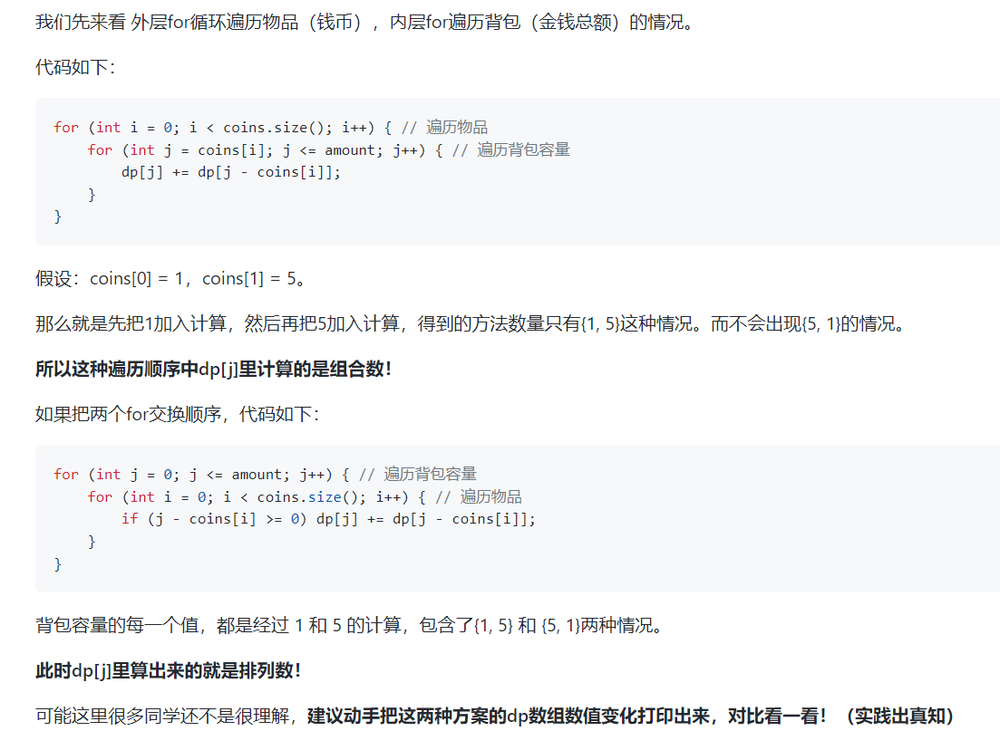
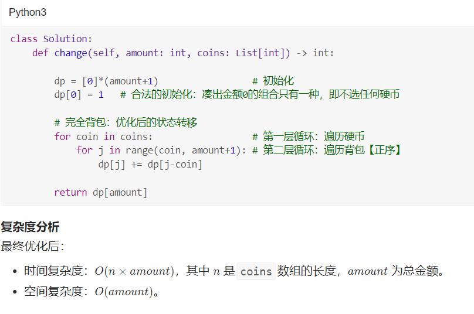

# 518. Coin Change II

You are given an integer array coins representing coins of different denominations and an integer amount representing a total amount of money.

Return the number of combinations that make up that amount. If that amount of money cannot be made up by any combination of the coins, return 0.

You may assume that you have an infinite number of each kind of coin.

The answer is guaranteed to fit into a signed 32-bit integer.
```
Example 1:

Input: amount = 5, coins = [1,2,5]
Output: 4
Explanation: there are four ways to make up the amount:
5=5
5=2+2+1
5=2+1+1+1
5=1+1+1+1+1
```
>更多细节见**背包.md**

正确的子问题定义应该是，problem(k,i) = problem(k-1, i) + problem(k, i-coins[k])

即前k个硬币凑齐金额i的组合数等于前k-1个硬币凑齐金额i的组合数加上在原来i-k的基础上使用硬币的组合数。
说的更加直白一点，那就是用前k的硬币凑齐金额i，要分为两种情况计算，
一种是没有用第K个硬币就凑齐了，一种是前面已经凑到了i-coins[k]，现在就差第k个硬币了。


完全背包（一维优化）
显然二维完全背包求解方案复杂度有点高。

我们需要对其进行「降维优化」，可以使用最开始讲的 数学分析方式，或者上一讲讲的 换元优化方式 进行降维优化。

由于 数学分析方式 十分耗时，我们用得更多的 换元优化方式。两者同样具有「可推广」特性。

因为后者更为常用，所以我们再来回顾一下如何进行「直接上手写一维空间优化的版本」 ：

在二维解法的基础上，直接取消「物品维度」
确保「容量维度」的遍历顺序为「从小到大」（适用于「完全背包」）
将形如 
f[i−1][j−k∗val] 的式子更替为 

f[j−val]，同时解决「数组越界」问题（将物品维度的遍历修改为从 


总结
本题的递推公式，其实我们在494. 目标和中就已经讲过了，而难点在于遍历顺序！

在求装满背包有几种方案的时候，认清遍历顺序是非常关键的。

>**如果求组合数就是外层for循环遍历物品，内层for遍历背包。**

>**如果求排列数就是外层for遍历背包，内层for循环遍历物品。**

可能说到排列数录友们已经有点懵了，后面Carl还会安排求排列数的题目，到时候在对比一下，大家就会发现神奇所在！

>**组合不强调元素之间的顺序，排列强调元素之间的顺序。**
## S1 (dp 二维数组)

```java
class Solution {
    public int change(int amount, int[] coins) {
        int n = coins.length;
        int[][] f = new int[n + 1][amount + 1];
        f[0][0] = 1;   // 使用0种货币，凑0元钱,也是一种方案
        for (int i = 1; i <= n; i++) {
            int v = coins[i - 1];
            for (int j = 0; j <= amount; j++) 
                for (int k = 0; k * v <= j; k++) 
                    f[i][j] += f[i - 1][j - k * v];  //状态计算方程
        }
        return f[n][amount];
    }
}
```

## S2 (dp 一维数组)


```java
class Solution {
    public int change(int amount, int[] coins) {
        //递推表达式
        int[] dp = new int[amount + 1];
        //初始化dp数组，表示金额为0时只有一种情况，也就是什么都不装
        dp[0] = 1;
        for (int i = 0; i < coins.length; i++) {
            for (int j = coins[i]; j <= amount; j++) {
                dp[j] += dp[j - coins[i]];
            }
        }
        return dp[amount];
    }
}
```

补充： 二维转一维优化
