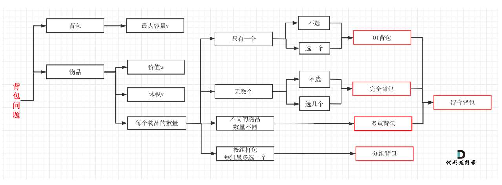
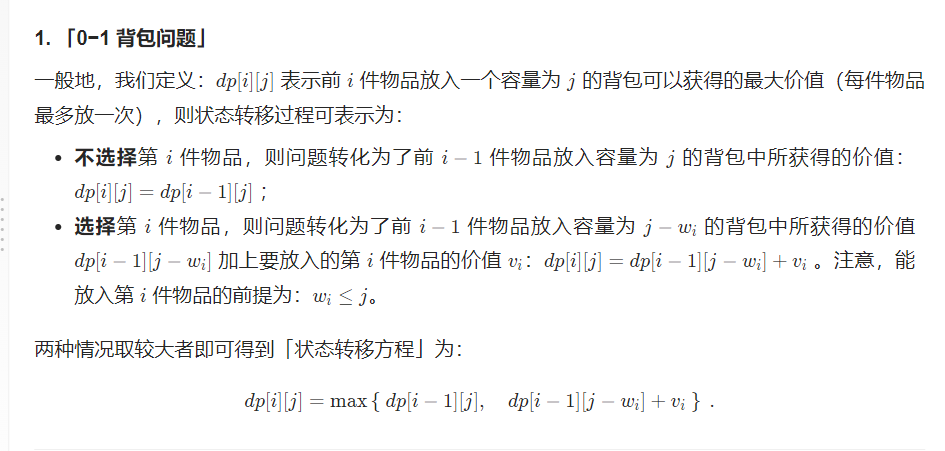
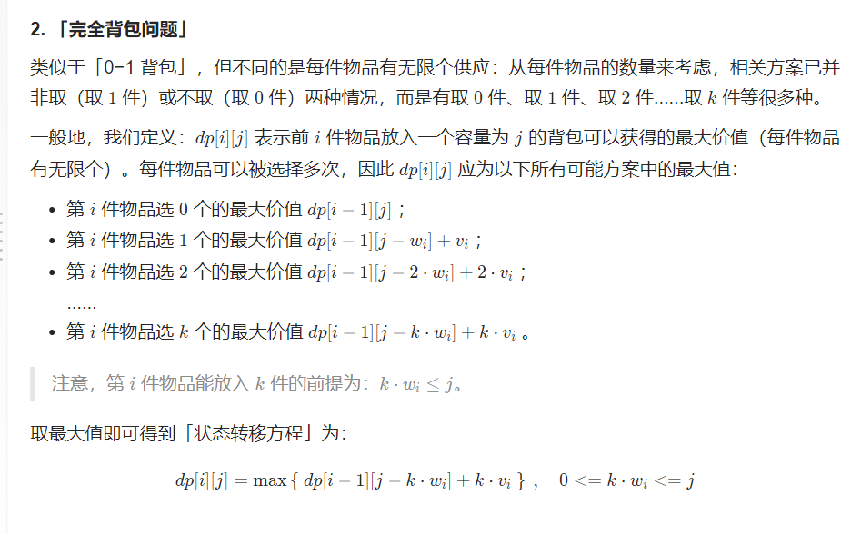
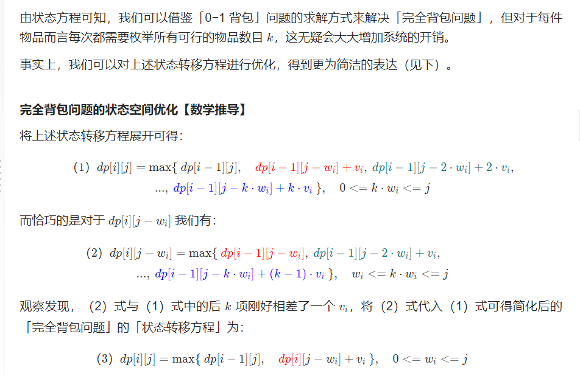

https://leetcode.cn/problems/coin-change-ii/solution/by-flix-e1vv/

一般问题： 我们有 n 件物品和一个容量 (capacity) 为 C 的背包，记第 
i 件物品的重量 (weight) 为 wi，价值(value) 为 vi，求将哪些物品装入背包可使价值总和最大。
0-1背包： 如果限定每件物品最多只能选取 1 次（即0或1次），则问题称为 0-1背包问题。

完全背包： 如果每件物品最多可以选取无限次，则问题称为 完全背包问题。

完全背包考虑的问题：
第i个物品要选几次

二维转一维 优化

