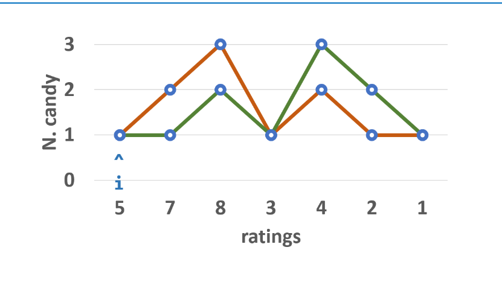
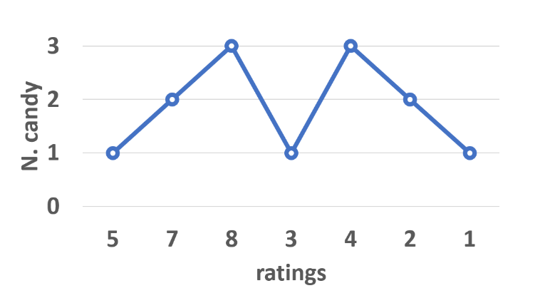

# 135. Candy

>There are n children standing in a line. Each child is assigned a rating value given in the integer array ratings.

>You are giving candies to these children subjected to the following requirements:

>**Each child must have at least one candy.**
**Children with a higher rating get more candies than their neighbors.**
Return the minimum number of candies you need to have to distribute the candies to the children.

```
Example 1:

Input: ratings = [1,0,2]
Output: 5
Explanation: You can allocate to the first, second and third child with 2, 1, 2 candies respectively.
```

## S1 (贪心)
解题思路：
规则定义： 设学生 A 和学生 B 左右相邻，A 在B 左边；
左规则： 当 ratings_B>ratings_A时，B 的糖比 A 的糖数量多。
右规则： 当 ratings_A>ratings_B时，A 的糖比 B 的糖数量多。
相邻的学生中，评分高的学生必须获得更多的糖果 等价于 所有学生满足左规则且满足右规则。

算法流程：

先从左至右遍历学生成绩 ratings，按照以下规则给糖，并记录在 left 中：

先给所有学生 1 颗糖；
若 ratings_i>ratings_{i-1}
​
 ，则第 i 名学生糖比第 i−1 名学生多 1 个。
若 ratings_i<=ratings_{i-1}
 ，则第 i 名学生糖数量不变。（交由从右向左遍历时处理。）
经过此规则分配后，可以保证所有学生糖数量 满足左规则 。
同理，在此规则下从右至左遍历学生成绩并记录在 right 中，可以保证所有学生糖数量 满足右规则 。

最终，取以上 2 轮遍历 left 和 right 对应学生糖果数的 最大值 ，这样则 同时满足左规则和右规则 ，即得到每个同学的最少糖果数量。

复杂度分析：

时间复杂度 O(N) ： 遍历两遍数组即可得到结果；
空间复杂度 O(N) ： 需要借用 left，right 的线性额外空间。

作者：jyd
链接：https://leetcode.cn/problems/candy/solution/candy-cong-zuo-zhi-you-cong-you-zhi-zuo-qu-zui-da-/
来源：力扣（LeetCode）
著作权归作者所有。商业转载请联系作者获得授权，非商业转载请注明出处。



```java
class Solution {
    public int candy(int[] ratings) {
        int[] left = new int[ratings.length];
        int[] right = new int[ratings.length];
        Arrays.fill(left, 1);
        Arrays.fill(right, 1);
        for(int i = 1; i < ratings.length; i++)
            if(ratings[i] > ratings[i - 1]) left[i] = left[i - 1] + 1;
        int count = left[ratings.length - 1];
        for(int i = ratings.length - 2; i >= 0; i--) {
            if(ratings[i] > ratings[i + 1]) right[i] = right[i + 1] + 1;
            count += Math.max(left[i], right[i]);
        }
        return count;
    }
}

```