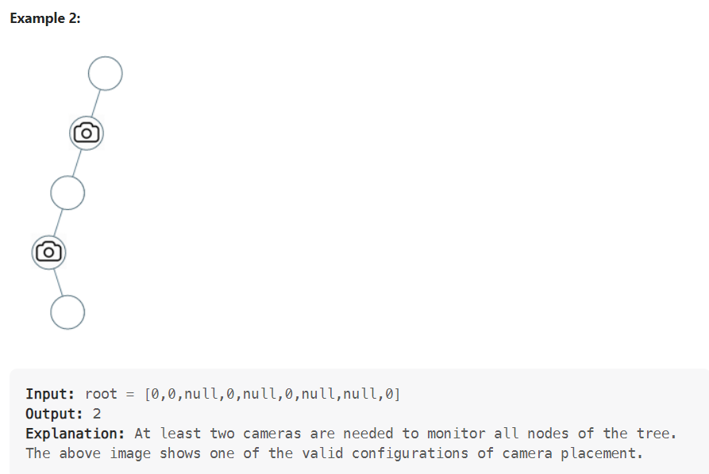

968. Binary Tree Cameras

>You are given the root of a binary tree. We install cameras on the tree nodes where each camera at a node can monitor its parent, itself, and its immediate children.

>Return the minimum number of cameras needed to monitor all nodes of the tree.

 

 ## S1 (贪心)
 
 这道题目首先要想，如何放置，才能让摄像头最小的呢？

从题目中示例，其实可以得到启发，我们发现题目示例中的摄像头都没有放在叶子节点上！

这是很重要的一个线索，摄像头可以覆盖上中下三层，如果把摄像头放在叶子节点上，就浪费的一层的覆盖。

所以把摄像头放在叶子节点的父节点位置，才能充分利用摄像头的覆盖面积。

那么有同学可能问了，为什么不从头结点开始看起呢，为啥要从叶子节点看呢？

因为头结点放不放摄像头也就省下一个摄像头， 叶子节点放不放摄像头省下了的摄像头数量是指数阶别的。

所以我们要从下往上看，局部最优：让叶子节点的父节点安摄像头，所用摄像头最少，整体最优：全部摄像头数量所用最少！

局部最优推出全局最优，找不出反例，那么就按照贪心来！

此时，大体思路就是从低到上，先给叶子节点父节点放个摄像头，然后隔两个节点放一个摄像头，直至到二叉树头结点。

此时这道题目还有两个难点：

二叉树的遍历
如何隔两个节点放一个摄像头

此时需要状态转移的公式，大家不要和动态的状态转移公式混到一起，本题状态转移没有择优的过程，就是单纯的状态转移！

来看看这个状态应该如何转移，先来看看每个节点可能有几种状态：

有如下三种：

该节点无覆盖
本节点有摄像头
本节点有覆盖
我们分别有三个数字来表示：

0：该节点无覆盖
1：本节点有摄像头
2：本节点有覆盖
大家应该找不出第四个节点的状态了。

```java
/**
 * Definition for a binary tree node.
 * public class TreeNode {
 *     int val;
 *     TreeNode left;
 *     TreeNode right;
 *     TreeNode() {}
 *     TreeNode(int val) { this.val = val; }
 *     TreeNode(int val, TreeNode left, TreeNode right) {
 *         this.val = val;
 *         this.left = left;
 *         this.right = right;
 *     }
 * }
 */
class Solution {
    int  res=0;
    public int minCameraCover(TreeNode root) {
        // 对根节点的状态做检验,防止根节点是无覆盖状态 .
        if(minCame(root)==0){
            res++;
        }
        return res;
    }
    /**
     节点的状态值：
       0 表示无覆盖 
       1 表示 有摄像头
       2 表示有覆盖 
    后序遍历，根据左右节点的情况,来判读 自己的状态
     */
    public int minCame(TreeNode root){
        if(root==null){
            // 空节点默认为 有覆盖状态，避免在叶子节点上放摄像头 
            return 2;
        }
        int left=minCame(root.left);
        int  right=minCame(root.right);
        
        // 如果左右节点都覆盖了的话, 那么本节点的状态就应该是无覆盖,没有摄像头
        if(left==2&&right==2){
            //(2,2) 
            return 0;
        }else if(left==0||right==0){
            // 左右节点都是无覆盖状态,那 根节点此时应该放一个摄像头
            // (0,0) (0,1) (0,2) (1,0) (2,0) 
            // 状态值为 1 摄像头数 ++;
            res++;
            return 1;
        }else{
            // 左右节点的 状态为 (1,1) (1,2) (2,1) 也就是左右节点至少存在 1个摄像头，
            // 那么本节点就是处于被覆盖状态 
            return 2;
        }
    }
}
```