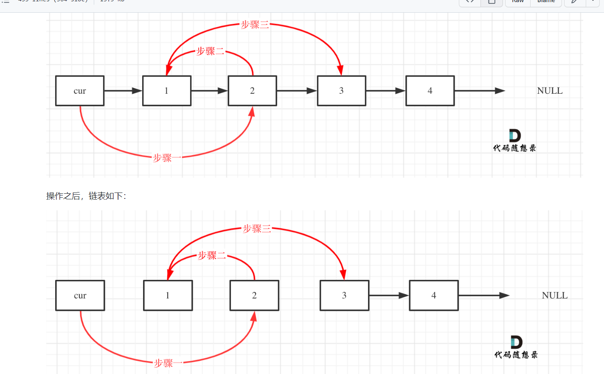
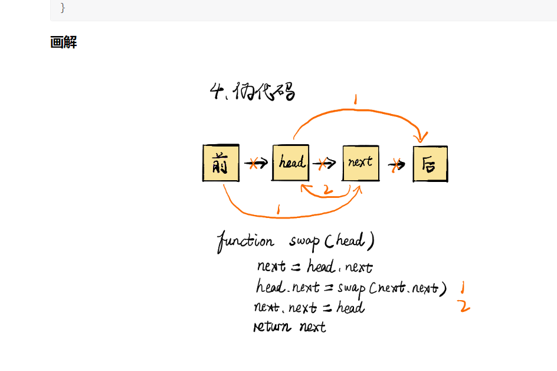

# 24. Swap Nodes in Pairs

Given a linked list, swap every two adjacent nodes and return its head. You must solve the problem without modifying the values in the list's nodes (i.e., only nodes themselves may be changed.)

```
 Input: head = [1,2,3,4]
Output: [2,1,4,3]
```
递归可能更好理解？
## Solution 1 (非递归)
建议使用虚拟头结点，这样会方便很多，要不然每次针对头结点（没有前一个指针指向头结点），还要单独处理。
```java
//1-2-3-4
    public ListNode swapPairs(ListNode head) {
        ListNode dummy = new ListNode(-1);
        dummy.next = head;

        ListNode cur = head, pre = dummy, tmp;
        //dummy->1->2->3->4->null
        // 👆    👆
        //pre   cur
        while (cur != null && cur.next != null) {
            tmp = cur.next.next;//3
            //dummy->1->2->3->4->null
            // 👆    👆     👆
            //pre   cur.   tmp
            pre.next = cur.next;//pre->2->3->4->null
            pre.next.next = cur;//pre->2->1->2->3->4->null
            pre = cur;//pre指向1
            //dummy->2->1->2->3->4->null
            //          👆    
            //          pre  
            pre.next = null;//断开
            //dummy->2->1->null
            //          👆    
            //          pre  
            cur = tmp;//cur负责继续迭代
            //3->4->null
            //👆    
            //cur  
        }
        if (cur != null) {
            //有落单的
            pre.next = cur;
        }
        return dummy.next;
    }
    ```

    不使用头节点
    ```java
    class Solution {
    public ListNode swapPairs(ListNode head) {
        ListNode pre = new ListNode(0);
        pre.next = head;
        ListNode temp = pre;
        while(temp.next != null && temp.next.next != null) {
            ListNode start = temp.next;
            ListNode end = temp.next.next;
            temp.next = end;
            start.next = end.next;
            end.next = start;
            temp = start;
        }
        return pre.next;
    }
}

```

```java
class Solution {
  public ListNode swapPairs(ListNode head) {
        ListNode dumyhead = new ListNode(-1); // 设置一个虚拟头结点
        dumyhead.next = head; // 将虚拟头结点指向head，这样方面后面做删除操作
        ListNode cur = dumyhead;
        ListNode temp; // 临时节点，保存两个节点后面的节点
        ListNode firstnode; // 临时节点，保存两个节点之中的第一个节点
        ListNode secondnode; // 临时节点，保存两个节点之中的第二个节点
        while (cur.next != null && cur.next.next != null) {
            temp = cur.next.next.next;
            firstnode = cur.next;
            secondnode = cur.next.next;
            cur.next = secondnode;       // 步骤一
            secondnode.next = firstnode; // 步骤二
            firstnode.next = temp;      // 步骤三
            cur = firstnode; // cur移动，准备下一轮交换
        }
        return dumyhead.next;  
    }
}
```

## Solution 2 (递归)
为什么/什么情况使用递归？
可以将一个任务分解成无数个子任务
每个子任务都是重复的子任务

next.next 也就是图中的“后”做为下一个部分（用于递归）
仔细想想三个步骤其实很好理解
（图中虽然标为1，2，但实际上应该是0，1，2，即代码第一行是0对应“前”到next的那个步骤）
```java
/**
 * Definition for singly-linked list.
 * public class ListNode {
 *     int val;
 *     ListNode next;
 *     ListNode() {}
 *     ListNode(int val) { this.val = val; }
 *     ListNode(int val, ListNode next) { this.val = val; this.next = next; }
 * }
 */
class Solution {
    public ListNode swapPairs(ListNode head) {
        if(head == null || head.next == null){
            return head;
        }
        // 这步其实只是把head.next的那个节点称为（标记为）next
        // 方便后来使用
        ListNode next = head.next;
        head.next = swapPairs(next.next);
        next.next = head;
        return next;
    }
}

```
```java
// 递归版本
class Solution {
    public ListNode swapPairs(ListNode head) {
        // base case 退出提交
        if(head == null || head.next == null) return head;
        // 获取当前节点的下一个节点
        ListNode next = head.next;
        // 进行递归
        ListNode newNode = swapPairs(next.next);
        // 这里进行交换
        next.next = head;
        head.next = newNode;

        return next;
    }
} 
```
