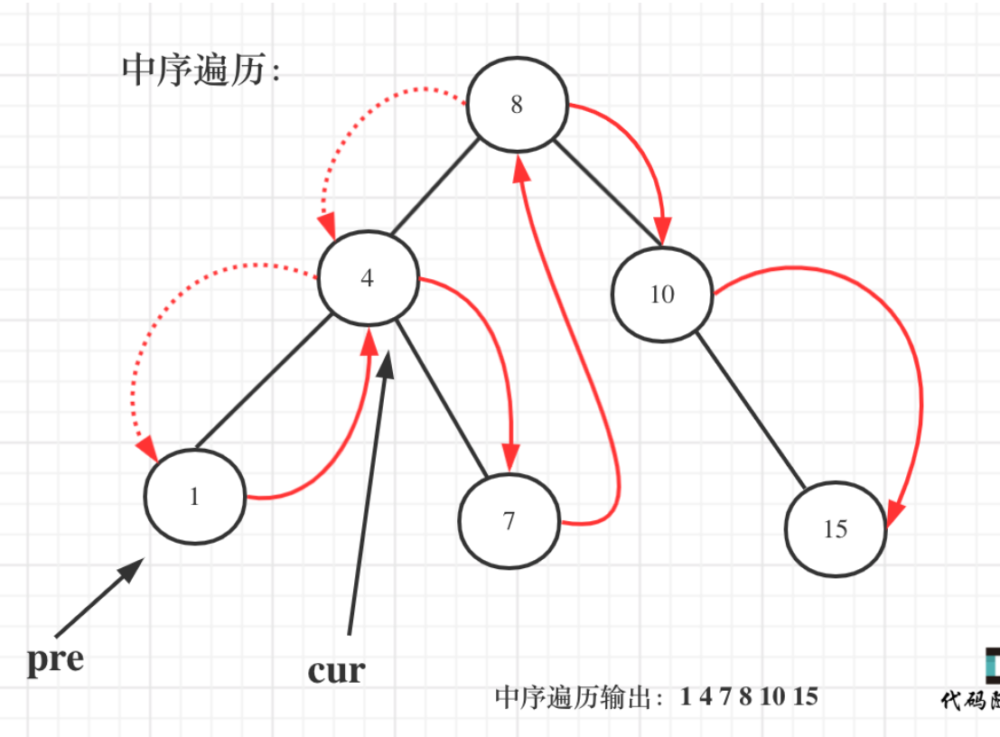

# 530. Minimum Absolute Difference in BST

>Given the root of a Binary Search Tree (BST), return the minimum absolute difference between the values of any two different nodes in the tree.

## Solution 1 (递归——双指针java版本) 待
#### 通过中序遍历二叉搜索树得到的关键码序列是一个递增序列。
这是二叉搜索树的一个重要性质，巧妙利用这一性质可以解决一系列二叉搜索树问题。

java: (root就是图中的cur)
pre根据中序遍历的顺序走，root根据pre的顺序走
### 双指针比较
 ```java
 // 不是特别懂，大概目前的理解是，往左和往右递归  “中”时比较
 class Solution {
    TreeNode pre;// 记录上一个遍历的结点
    int result = Integer.MAX_VALUE;
    public int getMinimumDifference(TreeNode root) {
       if(root==null)return 0;
       traversal(root);
       return result;
    }
    public void traversal(TreeNode root){
        if(root==null)return;
        //左
        traversal(root.left);
        //中
        if(pre!=null){
            result = Math.min(result,root.val-pre.val);
        }
        pre = root;
        //右
        traversal(root.right);
    }
}
```
## Solution 2（递归：python，转换成数组比较前后值版本）
python：
```python
class Solution:
    def getMinimumDifference(self, root: TreeNode) -> int:
        res = []   
        r = float("inf")
        def buildaList(root):  //把二叉搜索树转换成有序数组
            if not root: return None
            if root.left: buildaList(root.left)  //左
            res.append(root.val)  //中
            if root.right: buildaList(root.right)  //右
            return res
            
        buildaList(root)
        for i in range(len(res)-1):  // 统计有序数组的最小差值
            r = min(abs(res[i]-res[i+1]),r)
        return r
```

## Solution 3（迭代）
java
```java
class Solution {
    TreeNode pre;
    Stack<TreeNode> stack;
    public int getMinimumDifference(TreeNode root) {
        if (root == null) return 0;
        stack = new Stack<>();
        TreeNode cur = root;
        int result = Integer.MAX_VALUE;
        while (cur != null || !stack.isEmpty()) {
            if (cur != null) {
                stack.push(cur); // 将访问的节点放进栈
                cur = cur.left; // 左
            }else {
                cur = stack.pop(); 
                if (pre != null) { // 中
                    result = Math.min(result, cur.val - pre.val);
                }
                pre = cur;
                cur = cur.right; // 右
            }
        }
        return result;
    }
}
```
python
```python
class Solution:
    def getMinimumDifference(self, root: TreeNode) -> int:
        stack = []
        cur = root
        pre = None
        result = float('inf')
        while cur or stack:
            if cur: # 指针来访问节点，访问到最底层
                stack.append(cur)
                cur = cur.left
            else: # 逐一处理节点
                cur = stack.pop()
                if pre: # 当前节点和前节点的值的差值
                    result = min(result, abs(cur.val - pre.val))
                pre = cur
                cur = cur.right
        return result
        
```