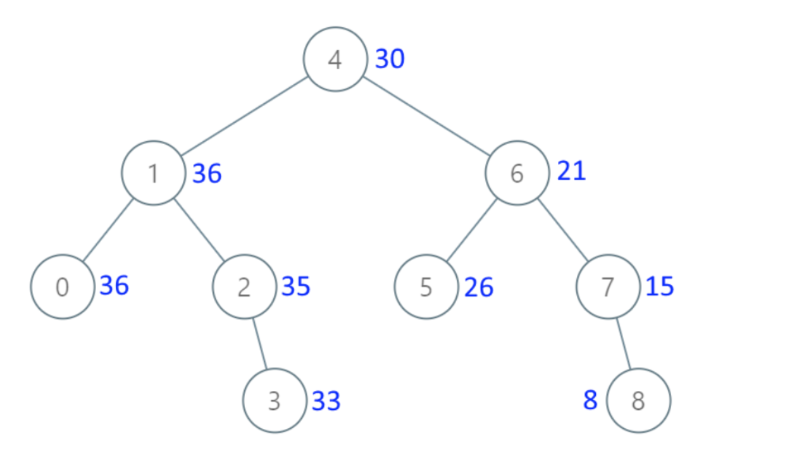

# 538. Convert BST to Greater Tree

Given the root of a Binary Search Tree (BST), convert it to a Greater Tree such that every key of the original BST is changed to the original key plus the sum of all keys greater than the original key in BST.

As a reminder, a binary search tree is a tree that satisfies these constraints:

The left subtree of a node contains only nodes with keys less than the node's key.
The right subtree of a node contains only nodes with keys greater than the node's key.
Both the left and right subtrees must also be binary search trees.
 
 ## Solution 1 （递归）
 
 转换成数组就简单多了
 同时注意到遍历顺序是右中左，也就是说是反中序遍历的
 java
```java
class Solution {
    int sum;
    public TreeNode convertBST(TreeNode root) {
        sum = 0;
        convertBST1(root);
        return root;
    }

    // 按右中左顺序遍历，累加即可
    public void convertBST1(TreeNode root) {
        if (root == null) {
            return;
        }
        convertBST1(root.right);
        sum += root.val;
        root.val = sum;
        convertBST1(root.left);
    }
}
```

pyton
```python
# Definition for a binary tree node.
# class TreeNode:
#     def __init__(self, val=0, left=None, right=None):
#         self.val = val
#         self.left = left
#         self.right = right
class Solution:
    def __init__(self):
        self.count = 0

    def convertBST(self, root: Optional[TreeNode]) -> Optional[TreeNode]:
        if root == None:
            return 
        '''
        倒序累加替换：  
        '''
        # 右
        self.convertBST(root.right)

        # 中
        # 中节点：用当前root的值加上pre的值
        self.count += root.val

        root.val = self.count 

        # 左
        self.convertBST(root.left)

        return root 
        
```